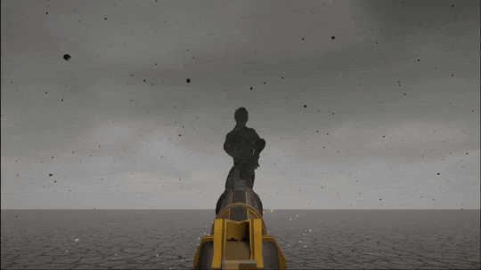

# MagnetsGiant_Unity-DOTS-Based-DotsEffect
## Overview

### The Magnets Giant that cannot be destroyed!!!
## [Video link to Reddit](https://www.reddit.com/r/Unity3D/comments/z5zglg/magnets_giant_unity_dots_based_dotseffect/)

This is a showcase project that I spent a week of my free time creating! Using Unity 2022.2.0b16 & ECS package v1.0 to realize the unique visual experience of the boss battle scene.  

Note:
- *Due to the high quantity of simulated particles in this project, it would not have been possible without ECS*.
- *For some unknow error, this project Cannot be built by Unity 2022.2.0b16 with windows 10 + il2cpp, so all the videos are recored inside the unity editor playmode.*

**Overall the system works as follow:**
1. Voxelize given skinned mesh to small dark cubes, i.e dots. (In the video, the dots count are 150,000+, where 142,667 dots driven by ECS, others created by using unity particle system)

2. Calculate the data needed for each dot, e.g Assigin each dot to closest bone.  
(Not by parenting but calculate local to world matrix, since we need control each dot precisely, due to the update order in Job System parenting is not suitable in our case)

3. Initialize all systems:
    - [Initialize dot and bone entities](Assets/Scripts/DotsEffect/Systems/DotsMeshSpawnSystem.cs)

    - [Initialize bullet entities](Assets/Scripts/DotsEffect/Systems/BulletsSpawnSystem.cs)

    - [Bullet entity system](Assets/Scripts/DotsEffect/Components/Bullet/)

    - [Bone entity system](Assets/Scripts/DotsEffect/Components/Ghost/) (Copied from skeleton of the skinned mesh to ECS Scene)

    - [Dot entity system](Assets/Scripts/DotsEffect/Components/Dot/)

    - [Bullet shooter](Assets/Scripts/DotsEffect/Components/Bullet/BulletShooter.cs) (MonoBehaviour)

    - [Boss(Ghost) controller](Assets/Scripts/DotsEffect/Components/Ghost/GhostController.cs) (MonoBehaviour)

4. In the [core update system](Assets\Scripts\DotsEffect\Systems\DotsEffectSystem.cs), we run updates in parallel through the Unity Job System:
    1. Update bullet entities movement.
    
    2. Update bone entities movement by copy the transform from the original Skeletal Animation, and calculate local to world matrix for assigned dots.

    3. Update dot entities movement: 

        - Follow the bone entities local transform ->  
        been hit fly away ->  
        wait for a while ->  
        bcak to follow the bone entities local transform.

5. Other visual & sound effects triggered by event, e.g begin to attack and foot land on ground.

## Assets
- [Character model and its animations](https://www.mixamo.com/)
- [Old West Shotgun](https://sketchfab.com/3d-models/old-west-shotgun-bd3ca4e9d3ce473a85c9f6630cee27c5)
- [Heavy Stomp   Free Sound Effect](https://www.youtube.com/watch?v=7gVxObDQI5Y)
- Voxelization modified from: [unity-voxel](https://github.com/mattatz/unity-voxel)
- FPS Controller Modified from: [Demo FPS Controller](https://sharpcoderblog.com/blog/unity-3d-fps-controller)